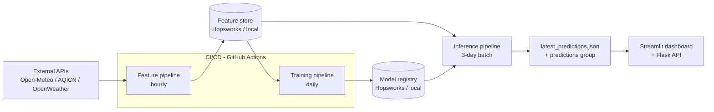

# Pearls AQI Predictor — Project Report

**Author:** Hayyan Khan  
**Repository:** https://github.com/Hayyankhan2/pearls-aqi-predictor  
**Live dashboard:** https://pearls-aqi-predictor-ay9svgwgkbt8absmhur5rx.streamlit.app/  
**City forecasted:** Karachi, Pakistan • **Horizon:** next 3 days

---

## 1. Executive summary

Pearls AQI Predictor forecasts the Air Quality Index (AQI) for Karachi for the
next three days using a **100% serverless machine-learning pipeline**. It follows
the modern **Feature / Training / Inference (FTI)** architecture: independent
pipelines collect data, engineer features, train models, and serve predictions,
all coordinated through a **feature store** (Hopsworks) and a **model registry**,
automated with **GitHub Actions**, and presented through an interactive
**Streamlit dashboard** with an optional **Flask API**.

The project intentionally supports two backends: a cloud/serverless **Hopsworks**
mode (the submitted/deployed mode) and a **local** mode (parquet/CSV + joblib) so
the demo runs even with no accounts or internet.

---

## 2. Problem & objective

Karachi regularly experiences unhealthy air. A 3-day AQI forecast lets people
plan outdoor activity and take precautions. The objective is an end-to-end,
automated ML system that:

- collects weather + pollutant data,
- engineers predictive features and stores them,
- trains and compares multiple models,
- serves a rolling 3-day forecast with hazard alerts,
- runs automatically without a managed server.

---

## 3. System architecture (FTI)



**Why FTI:** the three concerns are decoupled. The feature pipeline can run
hourly and cheaply; training runs daily; inference reads the latest model +
features. The feature store guarantees the **same feature definitions** are used
in training and serving, eliminating train/serve skew.

---

## 4. Requirement compliance matrix

| Requirement | Implemented in | Status |
|---|---|---|
| Fetch weather + pollutant data from external APIs (AQICN / OpenWeather) | `src/data_sources.py` (Open-Meteo, AQICN, OpenWeather) | ✅ |
| Time-based features (day/month) + derived features (AQI change rate) | `src/feature_engineering.py` | ✅ |
| Store processed features in a Feature Store | `src/feature_store.py` (Hopsworks + local) | ✅ |
| Historical data backfill | `pipelines/backfill_pipeline.py` | ✅ |
| Training pipeline reads features/targets from store | `pipelines/training_pipeline.py` | ✅ |
| Multiple models (Random Forest, Ridge, TensorFlow) | Ridge, RF, XGBoost, LightGBM, TF MLP, ensemble | ✅ |
| Evaluate with RMSE, MAE, R² | `pipelines/training_pipeline.py` + `models/metrics.json` | ✅ |
| Store trained models in a Model Registry | `src/model_registry.py` (Hopsworks + local) | ✅ |
| Feature pipeline runs hourly | `.github/workflows/feature-pipeline.yml` (cron `0 * * * *`) | ✅ |
| Training pipeline runs daily | `.github/workflows/training-pipeline.yml` (cron `30 0 * * *`) | ✅ |
| Use Airflow / GitHub Actions | GitHub Actions | ✅ |
| Load models + features and predict next 3 days | `pipelines/inference_pipeline.py` | ✅ |
| Interactive dashboard (Streamlit) + Flask/FastAPI | `app/streamlit_app.py` + `app/flask_api.py` | ✅ |
| Exploratory Data Analysis | `notebooks/eda.py` | ✅ |
| SHAP / LIME feature importance | SHAP in `pipelines/training_pipeline.py`, shown on dashboard | ✅ |
| Alerts for hazardous AQI | inference + dashboard alert banner (threshold 150) | ✅ |
| Multiple models from statistical to deep learning | Ridge (statistical) → TensorFlow MLP (deep) | ✅ |

---

## 5. Data sources (`src/data_sources.py`)

- **Open-Meteo** (no API key): historical weather archive, weather forecast, and
  air-quality archive/forecast. This is the backbone because it is free and
  provides **future weather**, which is required to forecast future AQI.
- **AQICN** (free token): the live official city AQI reading shown on the
  dashboard.
- **OpenWeather** (free key): an alternate pollutant provider.

Every fetch returns a tidy daily DataFrame keyed by `date`, so downstream code is
provider-agnostic. PM2.5 concentrations are converted to AQI using the official
US EPA breakpoint formula in `src/aqi.py`.

---

## 6. Feature engineering (`src/feature_engineering.py`)

Three families of features:

- **Time:** month, day-of-week, day-of-year encoded as sine/cosine (cyclical so
  Dec 31 and Jan 1 are "close"), weekend flag, season.
- **Weather + derived:** temperature, humidity, wind speed/direction, pressure,
  precipitation, a **stagnation index** (`pressure / wind` — high when still air
  traps pollution), and a temperature×humidity interaction.
- **AQI dynamics:** 1/2/3-day **lags**, 3- and 7-day **rolling means**, and the
  **AQI change rate** (the required derived feature).

`FEATURE_COLUMNS` is a fixed, ordered list saved alongside the model so inference
builds features identically to training. The **target** is the next day's AQI.

---

## 7. Feature store (`src/feature_store.py`)

A small interface (`insert` / `read` / `read_latest`) with two backends:

- **`HopsworksFeatureStore`** — versioned feature groups in the cloud (submitted
  serverless mode).
- **`LocalFeatureStore`** — parquet, with automatic **CSV fallback** when no
  parquet engine is present (this is what makes the offline demo robust).

`get_feature_store()` chooses the backend from `config.yaml` /
`HOPSWORKS_API_KEY`.

---

## 8. Historical backfill (`pipelines/backfill_pipeline.py`)

Fetches a multi-year history (default from 2022-01-01 to yesterday), engineers
features, and writes them to the feature store to create the training dataset.
Window configurable with `--start` / `--end`.

---

## 9. Training pipeline & models (`pipelines/training_pipeline.py`)

- **Chronological split** (last 60 days held out — never shuffle time series).
- Models: **Ridge** (linear baseline), **Random Forest**, **XGBoost**,
  **LightGBM**, and a small **TensorFlow MLP**, plus an **inverse-RMSE weighted
  ensemble**.
- **TimeSeriesSplit** cross-validation.
- Metrics: **RMSE, MAE, R²** per model, written to `models/metrics.json` and
  `models/model_comparison.csv`.
- **SHAP** importances computed for the best tree model.
- Best model (lowest holdout RMSE) is registered. Heavy libraries are wrapped in
  try/except so a missing dependency degrades gracefully instead of crashing.
- `--quick` skips TensorFlow + SHAP for fast CI runs.

---

## 10. Evaluation & how the forecast works

**Metrics:** RMSE/MAE are the average prediction error in AQI points (lower is
better); R² is variance explained (closer to 1 is better).

**3-day forecast logic (inference):** obtain the next-3-day forecast weather,
build the same feature vector for each future day seeding recent-AQI features
with the **last observed AQI** (persistence), then predict each day. Simple,
robust, and easy to explain. Limitation: days +2/+3 reuse the persistence seed
rather than chaining predictions (see Future work).

---

## 11. Model registry (`src/model_registry.py`)

Stores the fitted model, the **feature-column order**, the scaler, and the
metrics. **`HopsworksModelRegistry`** for cloud; **`LocalModelRegistry`**
(joblib + JSON) for offline. Inference and the dashboard load from whichever is
active.

---

## 12. Inference pipeline & alerts (`pipelines/inference_pipeline.py`)

Loads the registered model, reads the latest feature state, fetches forecast
weather (with an **offline climatology fallback** if the API is unreachable),
builds future features, predicts the next 3 days, attaches category + health +
hazard flags, writes `data/latest_predictions.json` and the predictions group,
and logs a **hazard alert** when predicted AQI crosses the configured threshold
(150).

---

## 13. Automated CI/CD — serverless (`.github/workflows/`)

- **`feature-pipeline.yml`** — cron `0 * * * *` (hourly) + manual dispatch:
  feature pipeline → inference, uploads the predictions artifact.
- **`training-pipeline.yml`** — cron `30 0 * * *` (daily) + manual dispatch:
  retrains and registers the best model, uploads metrics.
- **`ci.yml`** — runs unit tests on push / PR.

Both scheduled jobs pin **Python 3.11** and validate that Hopsworks secrets
exist (fail-fast). Required repo secrets: `HOPSWORKS_API_KEY`,
`HOPSWORKS_PROJECT`, optionally `AQICN_TOKEN`, `OPENWEATHER_API_KEY`.

> Note: GitHub disables scheduled workflows after ~60 days of repository
> inactivity and only runs schedules on the default branch; cron times can be
> delayed by a few minutes under load. Use **Actions → Run workflow** to demo on
> demand.

---

## 14. Web dashboard & API

- **`app/streamlit_app.py`** — hero header with backend/model status, a KPI
  strip, a Forecast tab (hazard alert + colour-coded 3-day cards + gauges), a
  Trends & EDA tab, a Model evidence tab (RMSE/MAE/R² leaderboard + SHAP), and an
  About tab (AQI glossary + architecture + disclaimer).
- **`app/flask_api.py`** — JSON endpoints: `/health`, `/forecast`,
  `/predictions`, `/metrics`, `/history/latest?n=30`, `POST /run-inference`.

---

## 15. Advanced analytics (`notebooks/eda.py`)

Generates four figures: AQI time series, monthly seasonality, AQI-vs-weather
scatter, and a correlation heatmap. SHAP provides per-feature impact on the
dashboard.

---

## 16. Repository structure

```text
pearls-aqi-predictor/
  config.yaml                # single control panel (city, horizon, backend, training)
  requirements.txt           # LEAN runtime/dashboard deps (used by Streamlit Cloud)
  requirements-full.txt      # full local training stack (TF/XGBoost/LightGBM/SHAP)
  requirements-actions.txt   # lean deps for scheduled GitHub Actions
  runtime.txt                # pins Python 3.11 for Streamlit Cloud
  .env.example
  src/{aqi,config,data_sources,feature_engineering,feature_store,model_registry,utils}.py
  pipelines/{backfill,feature,training,inference}_pipeline.py
  app/{streamlit_app,flask_api}.py
  notebooks/eda.py
  scripts/generate_sample_data.py
  tests/test_pipeline.py
  .github/workflows/{ci,feature-pipeline,training-pipeline}.yml
```

---

## 17. How to run

**Local offline (no accounts) — set `backend.mode: local` or `auto` in `config.yaml`:**
```bash
pip install -r requirements-full.txt        # Python 3.11 or 3.12
python -m scripts.generate_sample_data
python -m pipelines.training_pipeline --quick
python -m pipelines.inference_pipeline
streamlit run app/streamlit_app.py
```

**Real data:** replace the sample step with `python -m pipelines.backfill_pipeline`.

**Cloud/serverless:** set `HOPSWORKS_API_KEY` + `HOPSWORKS_PROJECT` (locally in
`.env`, in GitHub repo secrets, and in Streamlit Cloud secrets), keep
`backend.mode: hopsworks`, then let the workflows run or trigger them manually.

---

## 18. Problems encountered & how to fix them

### 18.1 `pip` / `python` not recognised (Windows)
**Symptom:** `pip : The term 'pip' is not recognized...` / `Python was not found`.  
**Cause:** Python not on PATH, or the Microsoft Store alias intercepting `python`.  
**Fix:** Install Python from python.org with **"Add python.exe to PATH"** ticked;
turn off the Store aliases (Settings → "Manage app execution aliases"); use
`python -m pip ...` or the `py` launcher (`py -m pip ...`). Reopen the terminal
after installing.

### 18.2 TensorFlow won't install on Python 3.14
**Symptom:** `Could not find a version that satisfies the requirement
tensorflow-cpu>=2.15.0` / `No matching distribution`.  
**Cause:** Python 3.14 is newer than TensorFlow's published wheels; there is no
3.14-compatible build yet.  
**Fix:** Use **Python 3.11 or 3.12** for local development (`py -3.12 -m pip
install -r requirements-full.txt`). If you must stay on 3.14, skip deep learning
(`enable_tensorflow: false` in `config.yaml`) and install the lean stack.

### 18.3 Streamlit Cloud deploy stuck / "unsatisfiable" + source-building pandas
**Symptom:** Deploy log shows `Using Python 3.14.5`, the TensorFlow resolver
fails, and pandas builds from source (very slow).  
**Cause:** Streamlit Cloud defaulted to Python 3.14 and installed the **full**
`requirements.txt` (including TensorFlow) for what only needs to be a dashboard.  
**Fix (this is the key deployment fix):**
1. Add **`runtime.txt`** containing `3.11`, AND set **Python 3.11** in the
   Streamlit Cloud app's *Advanced settings*.
2. Make the root **`requirements.txt` lean** (no TensorFlow/XGBoost/LightGBM/
   SHAP) so the deployed dashboard installs from wheels in seconds. Move the
   heavy stack to **`requirements-full.txt`** for local/full training.
3. Reboot/redeploy the app.

### 18.4 Hopsworks API key missing the `serving` scope
**Symptom:** Hopsworks login fails on the current SDK during serving-endpoint
checks.  
**Cause:** The API key lacked required scopes.  
**Fix:** Create a new key in Hopsworks with scopes: `project`, `featurestore`,
`job`, `kafka`, `modelregistry`, `dataset.create`, `dataset.view`,
`dataset.delete`, `serving`. Use the **current** Hopsworks SDK (do not pin an old
version — old versions resolve a legacy hostname that fails DNS on CI).

### 18.5 Pinning an old Hopsworks SDK broke networking
**Symptom:** `Name/hostname could not be resolved` in GitHub Actions.  
**Cause:** The old SDK targeted a deprecated hostname.  
**Fix:** Keep `hopsworks>=4.7.0,<4.8.0` (current) and fix the key scopes instead.

### 18.6 GitHub Actions secrets ≠ Streamlit Cloud secrets
**Symptom:** Workflows work but the deployed dashboard can't reach Hopsworks.  
**Cause:** They are two separate secret stores.  
**Fix:** Set `HOPSWORKS_API_KEY` and `HOPSWORKS_PROJECT` in **both** GitHub repo
secrets *and* Streamlit Cloud app secrets, then reboot the app.

### 18.7 Leaked API keys in chat
**Symptom:** Hopsworks keys were pasted in plaintext during troubleshooting.  
**Cause:** Sharing secrets in chat exposes them.  
**Fix:** **Revoke/rotate** every key that was pasted (Hopsworks → API keys →
delete; regenerate). Never commit keys — keep them in `.env` (gitignored) and in
the cloud secret stores only.

### 18.8 No network / API limits during a demo
**Symptom:** Forecast fetch fails offline; live AQICN unavailable.  
**Cause:** Sandboxes/venues without internet, or missing tokens.  
**Fix:** The inference pipeline has an offline climatology fallback, the feature
store has a local CSV fallback, and `scripts/generate_sample_data.py` seeds a
realistic dataset so the demo always runs.

---

## 19. Results & observations

Read the live numbers from `models/metrics.json` and the dashboard leaderboard.
Typically a gradient-boosting model (XGBoost/LightGBM) wins on RMSE because the
AQI–weather relationship is non-linear with interactions; Ridge is the
interpretable baseline; the ensemble is competitive and stable. SHAP usually
ranks recent-AQI lags, the stagnation index, and wind among the top drivers —
consistent with the physics of smog accumulation.

---

## 20. Limitations & future work

- Persistence seed reused for days +2/+3 → add **recursive multi-step**
  forecasting.
- Single city/station → extend to multiple cities (config-driven).
- No prediction intervals → add quantile or conformal uncertainty.
- Could add inversion-layer and fire/crop-burning signals for smog season.

---

## 21. Security notes

- Secrets live only in `.env` (gitignored), GitHub repo secrets, and Streamlit
  Cloud secrets.
- Rotate any key ever exposed (see 18.7).
- The repo contains no credentials; workflows read from `${secrets.*}`.

---

## 22. Viva Q&A (quick reference)

- **Why FTI?** Decouples feature/training/inference; the feature store stops
  train/serve skew.
- **What is "serverless" here?** No managed server: GitHub Actions runs compute
  on schedule, Hopsworks stores features/models, Streamlit Cloud hosts the UI.
- **Why Hopsworks + GitHub Actions over Airflow/Vertex?** Free, simplest, and
  integrates a feature store + model registry without extra infrastructure.
- **Why TimeSeriesSplit?** Never train on the future; respect chronology.
- **Difference between AQI and PM2.5?** AQI is a 0–500 index derived from
  pollutant concentrations via EPA breakpoints (see `src/aqi.py`).
- **How do you explain predictions?** SHAP mean-|value| feature importance.
- **How are hazard alerts triggered?** Predicted AQI ≥ 150 (configurable).
- **Biggest engineering challenge?** Python 3.14 / TensorFlow wheels and the
  Streamlit Cloud deploy — solved by pinning Python 3.11 and splitting lean vs
  full requirements (Section 18).

---

*This project is for education and demonstration. Forecasts are estimates and
are not a substitute for official public-health air-quality advisories.*
